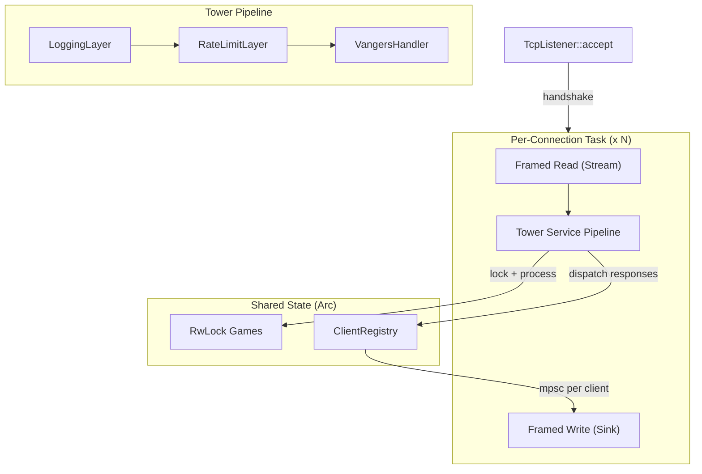
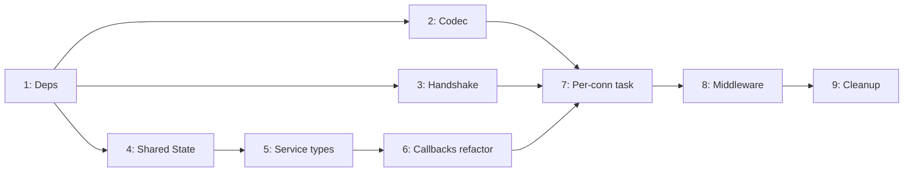

# Миграция vangers-srv на Tower + tokio_util::codec

## Ключевая проблема

Протокол Vangers --- stateful bidirectional: один входящий `Packet` порождает рассылку 0..N пакетов разным клиентам (`notify_player`, `notify_game`, `notify_all`). Tower модель `fn(Request) -> Response` не покрывает broadcast напрямую. Решение: Service обрабатывает пакет и возвращает `Vec<ResponseAction>`, а диспетчер на уровне connection task маршрутизирует ответы через shared `ClientRegistry`.

## Целевая архитектура




## Фазы реализации

### Фаза 1: Зависимости

Добавить в [vangers-srv/Cargo.toml](vangers-srv/Cargo.toml):

```toml
tower = { version = "0.5", features = ["util", "limit", "buffer", "timeout"] }
tower-service = "0.3"
tower-layer = "0.3"
tokio-util = { version = "0.7", features = ["codec"] }
bytes = "1"
futures = "0.3"
```

---

### Фаза 2: VangersCodec (`tokio_util::codec`)

Новый файл `vangers-srv/src/codec.rs`. Реализовать `Decoder<Item=Packet>` и `Encoder<Packet>` для Vangers length-prefix framing.

Текущий ручной парсинг в [client.rs](vangers-srv/src/client.rs) (строки 98-164) --- буфер `[0u8; i16::MAX]`, ручное склеивание фрагментов, вычисление `packet_size = 2 + LE16` --- полностью заменяется на:

```rust
struct VangersCodec;

impl Decoder for VangersCodec {
    type Item = Packet;
    type Error = io::Error;

    fn decode(&mut self, src: &mut BytesMut) -> Result<Option<Packet>, Self::Error> {
        if src.len() < 2 { return Ok(None); }
        let event_size = i16::from_le_bytes([src[0], src[1]]);
        if event_size < 0 { return Err(...); }
        let total = 2 + event_size as usize;
        if src.len() < total { src.reserve(total - src.len()); return Ok(None); }
        let frame = src.split_to(total);
        Ok(Some(Packet::from_slice(&frame)))
    }
}

impl Encoder<Packet> for VangersCodec {
    type Error = io::Error;
    fn encode(&mut self, item: Packet, dst: &mut BytesMut) -> Result<(), Self::Error> {
        dst.extend_from_slice(&item.as_bytes());
        Ok(())
    }
}
```

Это изолированное изменение, не зависящее от остальных фаз.

---

### Фаза 3: Извлечение handshake

Вынести функцию `auth()` из [client.rs](vangers-srv/src/client.rs) (строки 217-253) в отдельный модуль `vangers-srv/src/transport/handshake.rs`.

Handshake выполняется **до** создания `Framed`, на «сыром» `TcpStream`:

```rust
pub async fn perform_handshake(stream: &mut TcpStream) -> Result<u8, HandshakeError> { ... }
```

После успеха `TcpStream` оборачивается в `Framed<TcpStream, VangersCodec>`.

---

### Фаза 4: Shared State --- `Rc<RefCell>` -> `Arc<RwLock>`

Затронутые файлы:

- [game/game.rs](vangers-srv/src/game/game.rs) --- `worlds: Vec<Rc<RefCell<World>>>` -> `Vec<Arc<RwLock<World>>>`
- [player/player.rs](vangers-srv/src/player/player.rs) --- `world: Option<Rc<RefCell<World>>>` -> `Option<Arc<RwLock<World>>>`

Все вызовы `.borrow()` / `.borrow_mut()` меняются на `.read().await` / `.write().await` (или sync-вариант `std::sync::RwLock` если не нужен await).

Создать структуру `SharedState`:

```rust
pub struct SharedState {
    pub games: RwLock<Games>,
    pub clients: RwLock<ClientRegistry>,
    pub uptime: Uptime,
    games_id_counter: AtomicU32,
}
```

`ClientRegistry` --- `HashMap<ClientID, mpsc::Sender<Packet>>` --- реестр каналов записи для всех подключённых клиентов. Замена текущего `Vec<Client>` в [server.rs](vangers-srv/src/server/server.rs).

---

### Фаза 5: Определение типов Service

#### Зачем это нужно

В текущей архитектуре обработка пакета и отправка ответов **смешаны** в одном месте: каждый callback-обработчик напрямую вызывает `self.notify_player()` / `self.notify_game()` / `self.notify_all()` на объекте `Server`. Это жёстко связывает бизнес-логику (что делать с пакетом) с транспортной логикой (как и кому отправить ответ). Из-за этого:

- Невозможно вставить middleware (логирование, rate-limit, timeout) между приёмом пакета и его обработкой --- в Tower middleware оборачивают `Service`, а не произвольные методы.
- Невозможно тестировать обработчики изолированно от TCP-стека --- сейчас тесты вынуждены конструировать полный `Server` с `Vec<Client>`.
- Невозможно переиспользовать обработчики в другом контексте (например, replay из лога пакетов).

Фаза 5 вводит **контракт** между транспортным и бизнес-уровнями через Tower `Service` trait. Обработчик принимает `(ClientID, Packet)` и возвращает **декларативный** список действий `Vec<ResponseAction>` --- без побочных эффектов отправки. Рассылкой занимается вызывающий код (dispatcher в per-connection task).

#### Что создаётся

Новый модуль `vangers-srv/src/service/` с файлами `mod.rs`, `handler.rs`, `dispatch.rs`.

##### 1. `Target` --- кому адресован ответ

```rust
pub enum Target {
    /// Отправить только клиенту, от которого пришёл запрос.
    Sender,
    /// Отправить всем игрокам в той же игре, кроме отправителя.
    /// Заменяет текущий Server::notify_game().
    GameExceptSender,
    /// Отправить всем игрокам в игре, включая отправителя.
    /// Заменяет текущий Server::notify_all().
    AllInGame,
    /// Отправить конкретным клиентам по списку ID.
    /// Используется в DIRECT_SENDING, где получатели
    /// определяются битовой маской.
    Specific(Vec<ClientID>),
}
```

В текущем коде эти три паттерна рассылки размазаны по 15 callback'ам через прямые вызовы `self.notify_*`. `Target` делает намерение явным и позволяет dispatcher'у (фаза 7) обработать рассылку единообразно.

##### 2. `ResponseAction` --- единица ответа

```rust
pub struct ResponseAction {
    pub target: Target,
    pub packet: Packet,
}
```

Один входящий пакет может породить несколько `ResponseAction`. Например, `SET_WORLD` порождает до четырёх:


| #    | Target             | Packet               | Для чего                              |
| ---- | ------------------ | -------------------- | ------------------------------------- |
| 1    | `AllInGame`        | `PLAYERS_STATUS`     | Уведомить всех, что игрок стал GAMING |
| 2    | `GameExceptSender` | `PLAYERS_WORLD`      | Сообщить другим, в каком мире игрок   |
| 3    | `Sender`           | `SET_WORLD_RESPONSE` | Подтвердить отправителю вход в мир    |
| 4..N | `Sender`           | `UPDATE_OBJECT` x N  | Передать инвентарь мира отправителю   |


Текущий код в `set_world.rs` делает эти четыре вызова императивно (`self.notify_all(...)`, `self.notify_game(...)`, `self.notify_player(...)`, цикл `.for_each(|p| self.notify_player(...))`). После рефакторинга всё это станет единым `Vec<ResponseAction>`, который возвращается из функции.

##### 3. `VangersHandler` --- реализация `tower::Service`

```rust
pub struct VangersHandler {
    state: Arc<SharedState>,
}
```

Это центральная точка входа для обработки любого входящего пакета. `VangersHandler` реализует `tower::Service<(ClientID, Packet)>` и является тем самым «innermost service», который оборачивается middleware через `ServiceBuilder`.

```rust
impl Service<(ClientID, Packet)> for VangersHandler {
    type Response = Vec<ResponseAction>;
    type Error = BoxError;
    type Future = Pin<Box<dyn Future<Output = Result<Vec<ResponseAction>, BoxError>> + Send>>;

    fn poll_ready(&mut self, _cx: &mut Context<'_>) -> Poll<Result<(), Self::Error>> {
        Poll::Ready(Ok(()))
    }

    fn call(&mut self, (client_id, packet): (ClientID, Packet)) -> Self::Future {
        let state = self.state.clone();
        Box::pin(async move {
            match packet.action {
                Action::ATTACH_TO_GAME => handle_attach_to_game(&state, client_id, &packet).await,
                Action::REGISTER_NAME  => handle_register_name(&state, client_id, &packet).await,
                Action::SET_WORLD      => handle_set_world(&state, client_id, &packet).await,
                // ... остальные 12 Action ...
                _ => Err(format!("action {:?} not implemented", packet.action).into()),
            }
        })
    }
}
```

**Почему `Request = (ClientID, Packet)**`: Service должен знать, от какого клиента пришёл пакет, чтобы найти его игру/игрока в `SharedState`. `ClientID` назначается при подключении (фаза 7) и передаётся как часть запроса.

**Почему `Response = Vec<ResponseAction>**`: это декларативный результат обработки. Service не выполняет рассылку сам --- он описывает, что нужно разослать. Реальная отправка происходит в `dispatch_responses()` (фаза 7), которая резолвит `Target` в конкретные `mpsc::Sender<Packet>` через `ClientRegistry`.

**Почему `Future` boxed и `Send**`: Tower middleware (и `tokio::spawn`) требуют `Send`. `Arc<SharedState>` клонируется и перемещается в async block, что безопасно благодаря `Arc`. `Box::pin` необходим, потому что каждый `match`-бранч может иметь разный размер future.

**Почему `poll_ready` всегда `Ready(Ok(()))**`: сервер всегда готов обрабатывать пакеты --- backpressure управляется на уровне mpsc-каналов и `Framed` (через `set_backpressure_boundary`), а не через `poll_ready`. Если в будущем потребуется ограничивать нагрузку, это делается через middleware (`ConcurrencyLimitLayer`, `LoadShedLayer`), а не в самом handler'е.

##### 4. `dispatch_responses()` --- маршрутизация ответов

```rust
pub async fn dispatch_responses(
    state: &SharedState,
    sender_id: ClientID,
    actions: Vec<ResponseAction>,
) {
    let clients = state.clients.read().await;
    let games = state.games.read().await;

    for action in actions {
        let target_ids: Vec<ClientID> = match action.target {
            Target::Sender => vec![sender_id],
            Target::GameExceptSender => {
                // найти game по sender_id, собрать client_id всех игроков кроме sender
                resolve_game_players(&games, sender_id, false)
            }
            Target::AllInGame => {
                resolve_game_players(&games, sender_id, true)
            }
            Target::Specific(ids) => ids,
        };

        for id in target_ids {
            if let Some(tx) = clients.get(&id) {
                let _ = tx.send(action.packet.clone()).await;
            }
        }
    }
}
```

Эта функция вызывается в per-connection task (фаза 7) после каждого `svc.call()`. Она заменяет текущие методы `Server::notify`, `Server::notify_player`, `Server::notify_game`, `Server::notify_all`.

#### Связь с другими фазами

- **Зависит от фазы 4** (`SharedState`, `ClientRegistry` должны быть определены).
- **Необходима для фазы 6** (callback-обработчики переписываются с учётом нового контракта `-> Vec<ResponseAction>`).
- **Используется в фазе 7** (`VangersHandler` встраивается в Tower pipeline, `dispatch_responses` вызывается в per-connection task).
- **Оборачивается в фазе 8** (middleware слои применяются к `VangersHandler` через `ServiceBuilder`).

---

### Фаза 6: Рефакторинг callback-обработчиков

Все 15 обработчиков в [server/callback/](vangers-srv/src/server/callback/) нужно переписать:

**Было** (каждый --- trait на `Server`, вызывает `self.notify_*`):

```rust
impl OnUpdate_SetWorld for Server {
    fn set_world(&mut self, packet: &Packet, client_id: ClientID) -> Result<OnUpdateOk, OnUpdateError> {
        // ... мутирует self.games ...
        self.notify_game(client_id, &answer);
        self.notify_player(client_id, &answer2);
    }
}
```

**Стало** (свободная функция/метод, принимает `&SharedState`, возвращает `Vec<ResponseAction>`):

```rust
pub async fn handle_set_world(
    state: &SharedState,
    client_id: ClientID,
    packet: &Packet,
) -> Result<Vec<ResponseAction>, SetWorldError> {
    let mut games = state.games.write().await;
    // ... мутирует games ...
    Ok(vec![
        ResponseAction { target: Target::GameExceptSender, packet: answer },
        ResponseAction { target: Target::Sender, packet: answer2 },
    ])
}
```

Убирается trait-per-handler паттерн (`OnUpdate_SetWorld for Server`, `OnUpdate_AttachToGame for Server`, ...) --- вместо этого простые async функции.

Обработчики, порождающие множественные ответы (например, `attach_to_game` шлёт `ATTACH_TO_GAME_RESPONSE` + `Z_TIME_RESPONSE` + N * `UPDATE_OBJECT`), возвращают все ответы в одном `Vec<ResponseAction>`.

---

### Фаза 7: Per-connection task с Framed + Tower pipeline

Заменить текущий `Client::event_loop` + `Server::start` event loop.

Новая логика в `Server::start`:

```rust
loop {
    let (stream, addr) = listener.accept().await?;
    let state = self.state.clone();
    tokio::spawn(async move {
        // 1. Handshake
        let protocol = perform_handshake(&mut stream).await?;

        // 2. Framed transport
        let framed = Framed::new(stream, VangersCodec);
        let (write_sink, read_stream) = framed.split();

        // 3. Register client
        let client_id: ClientID = rand::random();
        let (tx, rx) = mpsc::channel(1000);
        state.clients.write().await.insert(client_id, tx);

        // 4. Spawn writer task: rx -> write_sink
        tokio::spawn(rx.map(Ok).forward(write_sink));

        // 5. Build Tower pipeline
        let svc = ServiceBuilder::new()
            .layer(LoggingLayer::new())
            // .rate_limit(100, Duration::from_secs(1))
            .service(VangersHandler::new(state.clone()));

        // 6. Process incoming packets
        read_stream.for_each(|packet| async {
            let actions = svc.call((client_id, packet)).await?;
            dispatch_responses(&state, client_id, actions).await;
        }).await;

        // 7. Cleanup on disconnect
        state.clients.write().await.remove(&client_id);
        handle_disconnect(&state, client_id).await;
    });
}
```

Функция `dispatch_responses` заменяет текущие `notify_player`/`notify_game`/`notify_all` --- находит нужные каналы в `ClientRegistry` и отправляет пакеты.

---

### Фаза 8: Middleware (Layer)

**LoggingLayer** --- замена текущей функции `view()` из [callback/mod.rs](vangers-srv/src/server/callback/mod.rs) (строки 156-178):

```rust
pub struct LoggingLayer;
impl<S> Layer<S> for LoggingLayer {
    type Service = LoggingService<S>;
    fn layer(&self, inner: S) -> Self::Service { LoggingService { inner } }
}

impl<S> Service<(ClientID, Packet)> for LoggingService<S>
where S: Service<(ClientID, Packet)> {
    fn call(&mut self, req: (ClientID, Packet)) -> Self::Future {
        tracing::info!("[<-] {:?}", req.1.action);
        self.inner.call(req)
    }
}
```

Дополнительно можно добавить `tower::limit::RateLimitLayer` для защиты от flood.

---

### Фаза 9: Удаление старого кода и cleanup

- Удалить [client.rs](vangers-srv/src/client.rs) (вся логика перенесена в codec + transport + service)
- Удалить `enum Connection`, `struct MpscData`, `Client::event_loop`
- Удалить trait `OnUpdate` и паттерн trait-per-handler из `callback/mod.rs`
- Удалить `Server::notify`, `Server::notify_player`, `Server::notify_game`, `Server::notify_all`
- Обновить тесты в callback-модулях (они сейчас создают `Server` напрямую --- нужно будет создавать `SharedState`)

---

## Порядок зависимостей между фазами




Фазы 2, 3, 4 могут выполняться параллельно. Фаза 7 --- точка сборки.

## Риски

- **Rc -> Arc**: все callback-обработчики используют `game.worlds` через `Rc<RefCell<World>>`. Замена на `Arc<RwLock>` может привести к deadlock'ам, если lock'и берутся в неправильном порядке.
- **Send + Sync bounds**: Tower Service требует `Send + Sync`. Текущий код не обязан быть Send (всё работает в одном task). Переход потребует, чтобы все типы в `SharedState` были Send + Sync.
- **Тесты**: 10+ модулей с unit-тестами завязаны на прямое создание `Server` / `Game` / `Player`. Их нужно обновить.

