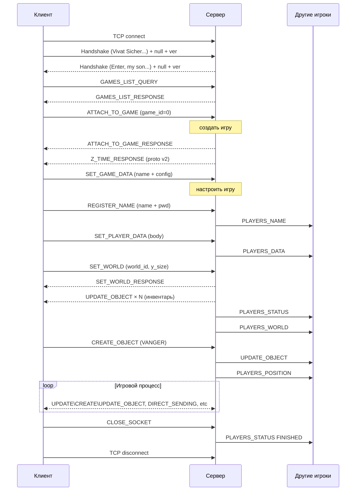

# Vangers-Srv: Архитектура проекта

## Обзор

**Vangers-Srv** — реимплементация оригинального сервера многопользовательской игры [Vangers](https://github.com/KranX/Vangers/) на Rust. Использует tokio как асинхронный runtime. Сервер обеспечивает сетевую игру для клиентов Vangers (Steam, GOG, собранных из исходников).

---

## Структура workspace

Проект организован как Cargo workspace из двух крейтов:

```
vangers-srv/                     (корень workspace)
├── Cargo.toml                   # workspace manifest
├── vangers-srv/                 # основной крейт — библиотека + бинарник сервера
│   └── src/
│       ├── main.rs              # точка входа, парсинг CLI-аргументов
│       ├── client.rs            # TCP-клиент: handshake, чтение/запись пакетов
│       ├── protocol.rs          # определение пакетов и Action-кодов
│       ├── vanject.rs           # игровые объекты (Vanject)
│       ├── game/                # модуль игровой логики
│       ├── player/              # модуль управления игроками
│       ├── server/              # модуль сервера с обработчиками команд
│       ├── shell/               # (заглушка) интерактивная консоль
│       └── utils/               # утилиты: конвертация байтов, uptime
└── vangers-srv-shell/           # вспомогательный крейт-обёртка
    └── src/main.rs
```

---

## Компоненты и их взаимосвязи

### 1. `main.rs` — Точка входа

Парсит CLI-аргументы через `clap`:

| Параметр | Env-переменная | По умолчанию | Описание |
|---|---|---|---|
| `--port` / `-p` | `VANGERS_PORT` | `2197` | Порт сервера |
| `--supress-log-server-time` | `VANGERS_SUPRESS_LOG_SERVER_TIME` | `false` | Подавить логи `SERVER_TIME` |
| `--supress-log-games-list-query` | `VANGERS_SUPRESS_LOG_GAMES_LIST_QUERY` | `false` | Подавить логи `GAMES_LIST_QUERY` |

Инициализирует `tracing-subscriber` для логирования и запускает `Server::start()`.

---

### 2. `server/` — Ядро сервера

#### `server/server.rs` — Структура `Server`

Центральный компонент, владеющий всем состоянием:

```
Server
├── conf: ServerConfig           # конфигурация (порт, настройки логов)
├── games: Games                 # HashMap<GameID, Game> — все игры
├── games_id_uniq: u32           # счётчик для генерации уникальных GameID
├── clients: Vec<Client>         # все подключённые TCP-клиенты
└── uptime: Uptime               # время работы сервера
```

**Event loop** (`Server::start`) построен на `tokio::select!` и обрабатывает два канала `mpsc`:

- **`event_rx`** — события от TCP-listener'а:
  - `Event::Add(Client)` — новое подключение
  - `Event::Halt` — остановка сервера

- **`clients_rx`** — сообщения от клиентов:
  - `Connection::Authenticated(protocol)` — клиент прошёл handshake
  - `Connection::Updated(Packet)` — получен пакет от клиента → `on_update()`
  - `Connection::Disconnected` — клиент отключился

**Система нотификации:**

| Метод | Кому отправляет |
|---|---|
| `notify_player(id, packet)` | Только конкретному игроку |
| `notify_game(id, packet)` | Всем в игре, **кроме** отправителя |
| `notify_all(id, packet)` | Всем в игре, **включая** отправителя |

#### `server/games.rs` — Обёртка `Games`

Newtype над `HashMap<GameID, Game>` с методами поиска по `GameID` и по `ClientID`.

#### `server/callback/` — Обработчики команд

Диспетчеризация происходит в `on_update()` по полю `packet.action`. Каждый обработчик реализован как отдельный trait для `Server`:

| Файл | Action | Описание |
|---|---|---|
| `attach_to_game.rs` | `ATTACH_TO_GAME` | Создание/подключение к игре |
| `register_name.rs` | `REGISTER_NAME` | Регистрация имени игрока |
| `set_game_data.rs` | `SET_GAME_DATA` | Установка конфигурации игры |
| `get_game_data.rs` | `GET_GAME_DATA` | Получение конфигурации игры |
| `set_player_data.rs` | `SET_PLAYER_DATA` | Обновление данных игрока (статистика) |
| `set_world.rs` | `SET_WORLD` | Вход в мир |
| `leave_world.rs` | `LEAVE_WORLD` | Выход из мира |
| `create_object.rs` | `CREATE_OBJECT` | Создание игрового объекта |
| `update_object.rs` | `UPDATE_OBJECT` | Обновление состояния объекта |
| `delete_object.rs` | `DELETE_OBJECT` | Удаление объекта |
| `direct_sending.rs` | `DIRECT_SENDING` | Отправка личного сообщения (чат) |
| `games_list_query.rs` | `GAMES_LIST_QUERY` | Список активных игр |
| `server_time_query.rs` | `SERVER_TIME_QUERY` | Запрос времени сервера |
| `total_players_data_query.rs` | `TOTAL_PLAYERS_DATA_QUERY` | Данные всех игроков |
| `close_socket.rs` | `CLOSE_SOCKET` | Отключение клиента |

Каждый обработчик возвращает `Result<OnUpdateOk, OnUpdateError>`, где:

- `OnUpdateOk::Response(Packet)` — отправить ответ клиенту-отправителю
- `OnUpdateOk::Broadcast(Packet)` — разослать всем в игре
- `OnUpdateOk::Complete` — обработчик сам управляет рассылкой

---

### 3. `client.rs` — TCP-клиент

Каждому входящему TCP-соединению создаётся `Client`:

```
Client
├── id: ClientID (usize)         # случайное уникальное значение (rand::random())
├── connection: Connection       # состояние: Connected → Authenticated → Disconnected
├── protocol: u8                 # версия протокола (1 или 2)
├── tx_server: Sender<MpscData>  # канал для отправки событий серверу
└── tx_client: Sender<Vec<u8>>   # канал для отправки данных клиенту
```

При создании запускается `event_loop`, который:
1. Выполняет **handshake** (`auth`)
2. Разделяет TCP-поток на read/write половины
3. Spawn'ит задачу на **запись** (читает из `rx_server` и пишет в TCP)
4. В основном цикле **читает** TCP, собирает пакеты из фрагментированного потока и отправляет серверу через `tx_server`

---

### 4. `game/` — Игровая логика

#### `game/game.rs` — Структура `Game`

```
Game
├── id: GameID (u32)
├── name: Vec<u8>                          # имя игры (C-строка в CP866)
├── players: Vec<Player>                   # игроки в этой игре
├── worlds: Vec<Rc<RefCell<World>>>        # миры (до 15)
├── birth_time: Uptime                     # время создания
├── config: Option<Config>                 # конфигурация (None = ещё не настроена)
└── vanjects: HashMap<i32, Vanject>        # все игровые объекты
```

Игра считается «настроенной» (`is_configured`) когда хост отправляет `SET_GAME_DATA`. Ненастроенные игры не показываются в списке.

Игроки получают уникальный `player_id` от 1 до 30 в рамках одной игры.

#### `game/mod.rs` — Типы игр

```
enum Type: VAN_WAR | MECHOSOMA | PASSEMBLOSS | MIR_RAGE | HUNTAGE | MUSTODONT | UNCONFIGURED
```

#### `game/config.rs` — Конфигурация игры

Базовые поля (общие для всех режимов): `initial_rnd`, `initial_cash`, `artefacts_using`, `in_escave_time`, `color`.

Режим-специфичные параметры хранятся в `GameMode`:
- **VanWar**: `nascency`, `team_mode`, `world_access`, `max_kills`, `max_time`
- **Mechosoma**: `world`, `product_quantity1/2`, `one_at_a_time`, `team_mode`
- **Passembloss**: `checkpoints_number`, `random_escave`
- **Mustodont**: `unique_mechos_name`, `team_mode`

#### `game/world.rs` — Мир

```
World
├── id: u8                                 # идентификатор мира (0–15)
├── y_size: i16                            # вертикальный размер
└── vanjects: HashMap<i32, Vanject>        # объекты в этом мире
```

---

### 5. `player/` — Управление игроками

#### `player/player.rs` — Структура `Player`

```
Player
├── client_id: ClientID          # связь с Client
├── bind: Option<Bind>           # player_id (1–30) в рамках игры
├── auth: Option<Auth>           # имя и пароль
├── body: Option<Body>           # статистика и характеристики
├── world: Option<Rc<RefCell<World>>>  # текущий мир
├── pos: Pos<i16>                # позиция (x, y)
└── status: Status               # INITIAL(0) → GAMING(1) → FINISHED(2)
```

#### `player/auth.rs` — Аутентификация

Хранит `name` (макс. 16 байт, C-строка в CP866) и `password` (хэш).

#### `player/bind.rs` — Привязка ID

Присваивает уникальный `player_id` (1–30) при подключении к игре. Используется в битовых масках при direct sending.

#### `player/body.rs` — Данные игрока

```
Body
├── kills: u8, deaths: u8
├── color: u8, world: u8
├── beebos: u32                  # игровая валюта
├── rating: f32
├── car_index: u8
├── data1: i16, data2: i16
├── birth_time: u32, net_id: i32
└── stats: Vec<u8>               # режим-специфичная статистика
```

#### `player/stats/` — Статистика по режимам

Отдельные структуры для каждого игрового режима:
- `VanWarStatistics`: max/min_live_time, kill/death_freq
- `MechosomaStatistic`: item_count1/2, transit_time, sneak/lost_count
- `PassemblossStatistic`: total/min/max_time, checkpoint_lighting
- `MustodontStatistic`: part_time1/2, body_time, make_time

---

### 6. `vanject.rs` — Игровые объекты (Vanject)

**Vanject** = **Van**gers Ob**ject** — любой игровой объект.

```
Vanject
├── id: i32                      # уникальный ID (кодирует тип, мир, владельца)
├── player_bind_id: u8           # ID владельца
├── time: i32                    # временная метка
├── pos: Pos<i16>                # позиция
├── radius: i16                  # радиус коллизии
└── body: Vec<u8>                # тело объекта (специфичное для типа)
```

**Типы объектов (NID):**

| Константа | Значение | Описание |
|---|---|---|
| `GLOBAL` | `0 << 16` | Глобальный объект |
| `DEVICE` | `1 << 16` | Устройство |
| `SLOT` | `2 << 16` | Слот |
| `SHELL` | `3 << 16` | Снаряд |
| `VANGER` | `9 << 16` | Транспорт игрока |
| `STUFF` | `11 << 16` | Предмет |
| `SENSOR` | `(12 << 16) \| (1 << 31)` | Сенсор (статический) |
| `TNT` | `(14 << 16) \| (1 << 31)` | Взрывчатка (статическая) |
| `TERRAIN` | `(15 << 16) \| (1 << 31)` | Элемент ландшафта (статический) |

**Кодирование Vanject ID (32-битное целое):**

```
┌─────┬────────┬──────────┬─────────┬────────┬───────┐
│ Bit │ 31     │ 30–26    │ 25–22   │ 21–16  │ 15–0  │
├─────┼────────┼──────────┼─────────┼────────┼───────┤
│     │ Static │ Station/ │ World   │ Object │ Index │
│     │ Flag   │ PlayerID │ ID      │ Type   │       │
└─────┴────────┴──────────┴─────────┴────────┴───────┘
```

- **Bit 31**: статический (1) / динамический (0)
- **Bits 30–26**: ID станции/игрока (0–31)
- **Bits 25–22**: ID мира (0–15)
- **Bits 21–16**: тип объекта
- **Bits 15–0**: порядковый индекс

---

### 7. `protocol.rs` — Определение протокола

Содержит `enum Action` (коды команд), `struct Packet` и traits для сериализации (`NetTransportSend`, `NetTransportReceive`, `NetTransport`).

---

### 8. `utils/` — Утилиты

- **`util.rs`**: функции `slice_le_to_u16/i16/u32/i32` для чтения little-endian значений из `&[u8]`
- **`uptime.rs`**: обёртка `Uptime` над `Instant` с форматированием HH:MM:SS

---

## Диаграмма взаимодействия компонентов

```
    Vangers Game Client
           │
           │ TCP :2197
           ▼
    ┌─────────────┐      mpsc (MpscData)       ┌────────────────────┐
    │   Client    │ ──────────────────────────▶│     Server        │
    │  (per conn) │                            │   (event loop)     │
    │             │ ◀──────────────────────────│                   │
    │  - auth     │      mpsc (Vec<u8>)        │  ┌───────────┐     │
    │  - read     │                            │  │  Games    │     │
    │  - write    │                            │  │ (HashMap) │     │
    └─────────────┘                            │  └─────┬─────┘     │
                                               │        │           │
                                               │   ┌────▼─────┐     │
                                               │   │   Game   │     │
                                               │   │          │     │
                                               │   │ players[]│     │
                                               │   │ worlds[] │     │
                                               │   │ vanjects │     │
                                               │   │ config   │     │
                                               │   └──────────┘     │
                                               │                    │
                                               │   callback/        │
                                               │   ├ attach_to_game │
                                               │   ├ register_name  │
                                               │   ├ set_world      │
                                               │   ├ create_object  │
                                               │   ├ ...            │
                                               └────────────────────┘
```

---

## Протокол поверх TCP

### Фаза 1: Handshake

При установлении TCP-соединения клиент и сервер обмениваются «магическими» строками для взаимной идентификации и согласования версии протокола.

**Клиент → Сервер:**
```
"Vivat Sicher, Rock'n'Roll forever!!!" \0 <protocol_version: u8>
```

**Сервер → Клиент (при успехе):**
```
"Enter, my son, please..." \0 <protocol_version: u8>
```

- `protocol_version` — 1 или 2. Значение 2 активирует дополнительные пакеты (например, `Z_TIME_RESPONSE` с Unix-временем при подключении к игре).
- При ошибке сервер отправляет `"Auth failed, bye-bye\0"` и закрывает соединение.

---

### Фаза 2: Обмен пакетами

После успешного handshake обмен происходит бинарными пакетами с length-prefix framing.

#### Структура пакета

```
┌──────────────────┬────────────┬───────────────────────┐
│  event_size (2B) │ action (1B)│    data (variable)    │
│  i16, LE         │ u8         │                       │
└──────────────────┴────────────┴───────────────────────┘
│◄─── заголовок ──►│◄────── event_size байт ───────────►│
```

| Поле | Тип | Размер | Описание |
|---|---|---|---|
| `event_size` | `i16` (LE) | 2 байта | Длина оставшейся части пакета: `1 (action) + len(data)` |
| `action` | `u8` | 1 байт | Код команды (см. таблицу ниже) |
| `data` | `[u8]` | `event_size - 1` байт | Полезная нагрузка (зависит от `action`) |

Полный размер пакета в TCP-потоке: `2 + event_size` байт.

Все многобайтовые целые числа передаются в **little-endian** порядке.

#### Чтение из TCP-потока

Пакеты могут приходить фрагментированно (один `read()` может содержать часть пакета или несколько пакетов). Клиент использует буфер размером `i16::MAX` (32767) байт и накапливает данные, пока не будет доступен полный пакет:

1. Считать `event_size` из первых 2 байт буфера
2. Если `2 + event_size > доступные данные` — ждать следующего `read()`
3. Иначе — распарсить пакет, сдвинуть offset, повторить

---

### Коды команд (Action)

#### Запросы от клиента (0x80–0x95)

| Code | Имя | Payload | Описание |
|------|-----|---------|----------|
| `0x81` | `GAMES_LIST_QUERY` | пусто | Запрос списка активных игр |
| `0x82` | `TOP_LIST_QUERY` | — | Запрос списка лучших игроков (не реализован) |
| `0x83` | `ATTACH_TO_GAME` | `game_id: i32` | Подключение к игре. `game_id=0` — создать новую |
| `0x84` | `RESTORE_CONNECTION` | — | Восстановление соединения (не реализован) |
| `0x86` | `CLOSE_SOCKET` | пусто | Отключение от игры |
| `0x88` | `REGISTER_NAME` | `name\0password\0` | Регистрация имени игрока (C-строки) |
| `0x89` | `SERVER_TIME_QUERY` | пусто | Запрос серверного времени |
| `0x8B` | `SET_WORLD` | `world_id: u8, y_size: i16` | Вход в мир |
| `0x8C` | `LEAVE_WORLD` | пусто | Выход из мира |
| `0x8D` | `SET_POSITION` | — | Установка позиции (не реализован) |
| `0x91` | `TOTAL_PLAYERS_DATA_QUERY` | пусто | Запрос данных всех игроков |
| `0x92` | `SET_GAME_DATA` | `name\0` + Config (бинарный) | Настройка игры (имя + конфигурация) |
| `0x93` | `GET_GAME_DATA` | пусто | Получение конфигурации игры |
| `0x94` | `SET_PLAYER_DATA` | Body (бинарный) | Обновление данных игрока |
| `0x95` | `DIRECT_SENDING` | `mask: u32, message\0` | Отправка сообщения группе игроков по битовой маске |

#### Операции с объектами (0x02–0x0C)

| Code | Имя | Payload | Описание |
|------|-----|---------|----------|
| `0x02` | `CREATE_OBJECT` | Vanject (бинарный) | Создание нового объекта |
| `0x04` | `DELETE_OBJECT` | `vanject_id: i32` | Удаление объекта |
| `0x08` | `UPDATE_OBJECT` | Vanject update (бинарный) | Обновление состояния объекта |
| `0x0C` | `HIDE_OBJECT` | — | Скрытие объекта (не реализован) |

#### Ответы сервера (0xC1–0xE3)

| Code | Имя | Описание |
|------|-----|----------|
| `0xC1` | `GAMES_LIST_RESPONSE` | Список игр: `count: u8`, далее `[game_id: u32, name\0]...` |
| `0xC2` | `TOP_LIST_RESPONSE` | Список лучших игроков |
| `0xC3` | `ATTACH_TO_GAME_RESPONSE` | Данные при подключении к игре |
| `0xC4` | `RESTORE_CONNECTION_RESPONSE` | Ответ на восстановление |
| `0xC6` | `SERVER_TIME` | Время сервера: `uptime * 256` как `i32` |
| `0xC7` | `SERVER_TIME_RESPONSE` | Ответ на запрос времени |
| `0xC8` | `SET_WORLD_RESPONSE` | Результат входа в мир: `world_id: u8, status: u8` |
| `0xCC` | `TOTAL_LIST_OF_PLAYERS_DATA` | Данные всех игроков |
| `0xCD` | `GAME_DATA_RESPONSE` | Конфигурация игры |
| `0xCE` | `DIRECT_RECEIVING` | Полученное личное сообщение: `sender_id: u8, message\0` |
| `0xCF` | `PLAYERS_POSITION` | Позиция игрока: `player_id: u8, x: i16, y: i16` |
| `0xD1` | `PLAYERS_WORLD` | Мир игрока: `player_id: u8, world_id: u8` |
| `0xD2` | `PLAYERS_STATUS` | Статус игрока: `player_id: u8, status: u8` |
| `0xD3` | `PLAYERS_DATA` | Данные игрока: `player_id: u8` + Body |
| `0xD4` | `PLAYERS_RATING` | Рейтинг игрока |
| `0xD5` | `PLAYERS_NAME` | Имя игрока: `player_id: u8, name\0` |
| `0xE3` | `Z_TIME_RESPONSE` | Unix timestamp: `u32` (только протокол v2) |

---

### Детали формата ключевых пакетов

#### `ATTACH_TO_GAME` (0x83)

**Запрос:**
```
┌──────────────┐
│ game_id: i32 │   0 = создать новую игру
└──────────────┘
```

**Ответ (`ATTACH_TO_GAME_RESPONSE`, 0xC3):**
```
┌───────────┬────────────┬────────────────┬───────────┬──────────────────────┐
│ game_id   │ configured │ birth_time     │ player_id │ id_offsets[16]       │
│ u32 (4B)  │ u8 (1B)    │ i32 (4B)       │ u8 (1B)   │ u16[16] (32B)        │
└───────────┴────────────┴────────────────┴───────────┴──────────────────────┘
```

После ответа сервер дополнительно шлёт:
- `Z_TIME_RESPONSE` (для протокола v2) — Unix timestamp
- `UPDATE_OBJECT` для каждого существующего vanject в игре

#### `REGISTER_NAME` (0x88)

**Запрос:**
```
┌─────────────────────┬───────────────────────┐
│ name\0 (C-строка)   │ password\0 (C-строка) │
└─────────────────────┴───────────────────────┘
```

Имя ограничено 16 байтами. Непечатные символы заменяются на `*`.

**Broadcast (`PLAYERS_NAME`, 0xD5) — всем кроме отправителя:**
```
┌───────────┬─────────────────────┐
│ player_id │ name\0              │
│ u8 (1B)   │                     │
└───────────┴─────────────────────┘
```

#### `SET_GAME_DATA` (0x92)

**Запрос:**
```
┌─────────────────┬────────────────────────────────────────────────┐
│ name\0          │ Config (бинарный, см. ниже)                    │
└─────────────────┴────────────────────────────────────────────────┘
```

**Формат Config:**
```
┌─────────────┬───────────┬──────────────┬──────────────────┬───────────────┬───────┬──────────────┐
│ initial_rnd │ game_type │ initial_cash │ artefacts_using  │ in_escave_time│ color │ mode_params  │
│ i32 (4B)    │ i32 (4B)  │ i32 (4B)     │ i32 (4B)         │ i32 (4B)      │ i32   │ variable     │
└─────────────┴───────────┴──────────────┴──────────────────┴───────────────┴───────┴──────────────┘
```

`game_type`: 0=VanWar, 1=Mechosoma, 2=Passembloss, 3=MirRage, 4=Huntage, 5=Mustodont

#### `SET_WORLD` (0x8B)

**Запрос:**
```
┌─────────────┬──────────────┐
│ world_id    │ y_size       │
│ u8 (1B)     │ i16 (2B)     │
└─────────────┴──────────────┘
```

**Ответ (`SET_WORLD_RESPONSE`, 0xC8) — отправителю:**
```
┌──────────┬────────────┐
│ world_id │ new_world  │
│ u8 (1B)  │ u8 (1B)    │   1 = новый мир создан, 0 = мир уже существовал
└──────────┴────────────┘
```

Дополнительно рассылается:
- `PLAYERS_STATUS` (если статус изменился на GAMING) — всем
- `PLAYERS_WORLD` — всем кроме отправителя
- `UPDATE_OBJECT` для инвентаря текущего мира — отправителю

#### `CREATE_OBJECT` (0x02)

**Запрос — Vanject Create:**
```
┌───────────┬──────────┬──────────┬────────────┬────────────────────────┐
│ id: i32   │ time: i32│ pos (4B) │ radius: i16│ [y_half*] + body       │
│ (4B)      │ (4B)     │ x,y i16  │ (2B)       │ variable               │
└───────────┴──────────┴──────────┴────────────┴────────────────────────┘
* y_half_size_of_screen (1B) — только для NID::VANGER
```

Для `NID::VANGER` объектов сервер также обновляет позицию игрока и рассылает `PLAYERS_POSITION`.

#### `DIRECT_SENDING` (0x95)

**Запрос:**
```
┌────────────┬────────────────────┐
│ mask: u32  │ message\0          │
│ (4B)       │ C-строка           │
└────────────┴────────────────────┘
```

`mask` — битовая маска получателей. Бит N соответствует `player_id = N`. Длина сообщения ограничена 140 символами.

**Рассылка (`DIRECT_RECEIVING`, 0xCE) — адресатам:**
```
┌───────────────┬──────────────────┐
│ sender_id: u8 │ message\0        │
└───────────────┴──────────────────┘
```

#### `SERVER_TIME_QUERY` (0x89)

**Ответ (`SERVER_TIME`, 0xC6):**
```
┌──────────────────────┐
│ uptime * 256 : i32   │   (аптайм сервера в секундах × 256)
└──────────────────────┘
```

#### `GAMES_LIST_RESPONSE` (0xC1)

```
┌──────────────┬───────────────────────────────────────────────┐
│ count: u8    │ [game_id: u32 (4B), title\0] × count         │
└──────────────┴───────────────────────────────────────────────┘
```

Заголовок игры формируется как: `"[Rust-SRV] " + game_name + ": " + players_count + " " + mode_char + " " + uptime`.

---

### Traits сериализации

```rust
trait NetTransportSend {
    fn to_vangers_byte(&self) -> Vec<u8>;
}

trait NetTransportReceive: Sized {
    fn from_slice(slice: &[u8]) -> Option<Self>;
}

trait NetTransport: NetTransportSend + NetTransportReceive {}
```

Реализуют: `Pos<i16>`, `Body`, `Config`, `VanWar`, `Mechosoma`, `Passembloss`, `Mustodont`, `Vanject` (свои методы).

---

### Жизненный цикл сессии (примерное представление)


